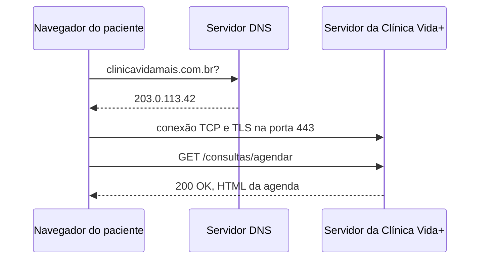

## O caminho de uma requisição



## Evidência do DNS

Domínio investigado: `uninove.br`

Comando executado: `nslookup uninove.br`

```
Servidor:  dns.google
Address:  8.8.8.8

Não é resposta autoritativa:
Nome:    uninove.br
Address:  167.99.0.217
```

Comando executado: `ping uninove.br`

```
Disparando uninove.br [167.99.0.217] com 32 bytes de dados:
Resposta de 167.99.0.217: bytes=32 tempo=121ms TTL=53
Resposta de 167.99.0.217: bytes=32 tempo=120ms TTL=53
Resposta de 167.99.0.217: bytes=32 tempo=121ms TTL=53
Resposta de 167.99.0.217: bytes=32 tempo=119ms TTL=53

Estatísticas do Ping para 167.99.0.217:
    Pacotes: Enviados = 4, Recebidos = 4, Perdidos = 0 (0% de perda)
Aproximar um número redondo de vezes em milissegundos:
    Mínimo = 119ms, Máximo = 121ms, Média = 120ms
```

O IP devolvido pelo `nslookup` (`167.99.0.217`) é o mesmo que respondeu ao `ping`, confirmando a tradução do nome `uninove.br` feita pelo DNS antes de qualquer conexão HTTP.

## Evidência do HTTP

Site investigado no DevTools (aba **Network**, com `F12`): `crm.uninove.br`

| Método | Recurso                     | Código de status |
| ------ | ---------------------------- | ----------------- |
| GET    | useBranding-DSFJg_40.css     | 200               |
| GET    | index.5d9d533.css            | 200               |
| GET    | f8f65a2.js                   | 200               |
| GET    | 47f5ecc3.7f2eeff.js          | 304               |

Cabeçalhos observados na requisição `useBranding-DSFJg_40.css`:

```
Host: crm.uninove.br
Content-Type: text/css
User-Agent: Mozilla/5.0 (Windows NT 10.0; Win64; x64) AppleWebKit/537.36 (KHTML, like Gecko) Chrome/154.0.0.0 Safari/537.36
```

### Teste do 404

Peço um endereço inexistente, `github.com/pagina-que-nao-existe-123`, e o servidor devolve `404 Not Found`:

```
URL da solicitação: https://github.com/pagina-que-nao-existe-123
Método da solicitação: GET
Código de status: 404 Not Found
```

> Observação: o mesmo teste em `uninove.br/pagina-que-nao-existe-123` não devolveu um 404 direto — resultou em uma cadeia de redirecionamentos (`307` → `301` → `503`), provavelmente por alguma proteção ou balanceador de carga na frente do site. Por isso o teste de 404 foi refeito em `github.com`, que devolve a resposta esperada para um caminho inexistente.

## Por que o formulário de agendamento precisa de HTTPS

O formulário de agendamento da Clínica Vida+ carrega dados pessoais sensíveis do paciente, como CPF, telefone e data de nascimento. Se esses dados trafegassem por HTTP comum, em texto puro, qualquer pessoa na mesma rede — o wi-fi da sala de espera, por exemplo — poderia interceptar e ler essas informações. O HTTPS envolve o mesmo HTTP dentro de um túnel TLS, que criptografa o conteúdo da conversa, garante que ele não foi alterado no caminho e, pelo certificado do servidor, comprova que o paciente está realmente se comunicando com o servidor da clínica, e não com um impostor na mesma rede.
